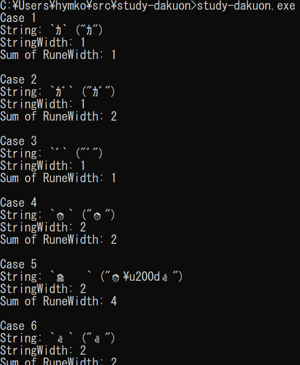
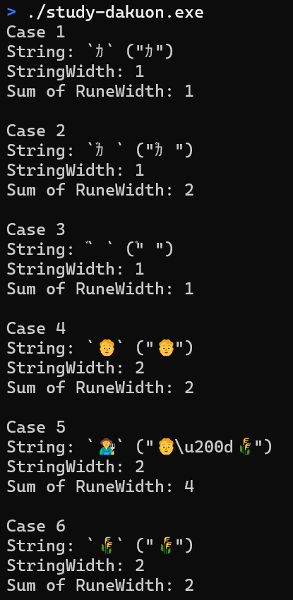

半角カナの濁音の文字幅カウントがおかしい
=======================================

+ 絵文字での合字では、各文字の幅の合計ではなく、1文字分の桁とする  
  (結果としてその一文字は2桁となることが多い)
+ 半角カナの濁音では、濁音記号を含む2文字の幅の合計とする  
  (1桁+1桁=2桁)

があるべき姿だが、[go-runewidth](https://github.com/mattn/go-runewidth) の [StringWidth] では濁音記号を含む2文字は、どうも絵文字での合字と同じ扱いになるらしく、1桁と算出されてしまう。

[StringWidth] を使っていたケースについては、これを排除するために [RuneWidth] を何回も呼べばよいだけの話が、[Truncate] などはそうもいかない。

修正パッチを送るにしても、一般の合字と濁音のケースを効率的に分けるアイデアを思いつかないため、手をこまねいている。さらに、[グリフを分割するライブラリ](https://github.com/clipperhouse/uax29)はメンテナが別であるため、対応が難しくなることが予想される。

なお、拙作のツールでは runewidth.Truncate 用の簡単なラッパー関数を作って回避した。

- [Fix display overflow caused by halfwidth kana with voiced/semi-voiced sound marks by hymkor · Pull Request #48 · hymkor/csvi](https://github.com/hymkor/csvi/pull/48)

[StringWidth]: https://pkg.go.dev/github.com/mattn/go-runewidth#StringWidth
[Truncate]: https://pkg.go.dev/github.com/mattn/go-runewidth#Truncate
[RuneWidth]: https://pkg.go.dev/github.com/mattn/go-runewidth#RuneWidth


```main.go
package main

import (
    "fmt"

    "github.com/mattn/go-runewidth"
)

func main() {
    tests := []string{
        "\uFF76",
        "\uFF76\uFF9E",
        "\uFF9E",
        "\U0001F9D1",
        "\U0001F9D1\u200D\U0001F33E",
        "\U0001F33E",
    }

    for i, s := range tests {
        fmt.Printf("Case %d\n", i+1)
        fmt.Printf("String: `%v` (%#v)\n", s, s)
        fmt.Printf("StringWidth: %d\n", runewidth.StringWidth(s))
        rw := 0
        for _, c := range s {
            rw += runewidth.RuneWidth(c)
        }
        fmt.Printf("Sum of RuneWidth: %d\n", rw)
        fmt.Println()
    }
}
```

```./study-dakuon |
Case 1
String: `ｶ` ("ｶ")
StringWidth: 1
Sum of RuneWidth: 1

Case 2
String: `ｶﾞ` ("ｶﾞ")
StringWidth: 1
Sum of RuneWidth: 2

Case 3
String: `ﾞ` ("ﾞ")
StringWidth: 1
Sum of RuneWidth: 1

Case 4
String: `🧑` ("🧑")
StringWidth: 2
Sum of RuneWidth: 2

Case 5
String: `🧑‍🌾` ("🧑\u200d🌾")
StringWidth: 2
Sum of RuneWidth: 4

Case 6
String: `🌾` ("🌾")
StringWidth: 2
Sum of RuneWidth: 2

```





```go.mod
module github.com/hymkor/study-dakuon

go 1.20

require github.com/mattn/go-runewidth v0.0.19

require github.com/clipperhouse/uax29/v2 v2.2.0 // indirect
```
